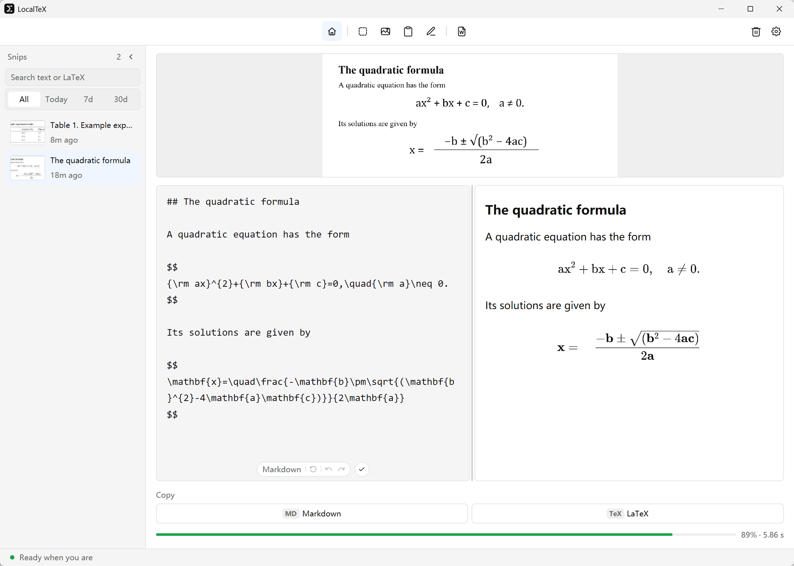

  

<h1 align="center">LocalTeX</h1>

<strong>Turn screenshots into text, formulas, and tables you can use.</strong>

Offline OCR for papers, lecture notes, and everyday research. Capture a region, review the result, and copy Markdown or LaTeX.

  <a href="#get-localtex">Get LocalTeX</a> ·
  <a href="docs/development.md">Development</a> ·
  <a href="https://github.com/kenanking/LocalTeX/issues">Report an issue</a>

  
  
  

## Why LocalTeX?

- **Offline and private.** Recognize locally without an account, API key, or cloud service.
- **Images and handwriting.** Extract text, formulas, and tables from screenshots, or write formulas on the drawing board.
- **Ready to reuse.** Copy Markdown or LaTeX, or open the result in Word.
- **Review and revisit.** Edit recognized content and find earlier results in a searchable local history.

## Get LocalTeX

Check [Releases](https://github.com/kenanking/LocalTeX/releases) for available builds and release notes.

| Platform | Support |
|---|---|
| Windows x86_64 | Native desktop app, screen capture, global shortcuts, and system tray |
| Linux x86_64, X11 | Native desktop app; Ubuntu 22.04 / glibc 2.35 or newer |
| Linux Wayland | Not supported; use an X11 session |
| macOS | Outside the supported platforms |

Application packages include the OCR models for offline recognition.

## Feedback

[Open an issue](https://github.com/kenanking/LocalTeX/issues) with your OS, the version shown in **Settings → System**, and steps to reproduce. For OCR issues, include an image you are comfortable sharing and the expected result.

## For developers

LocalTeX is a single Rust package built with [GPUI](https://github.com/zed-industries/zed/tree/main/crates/gpui). Recognition uses local ONNX models: PP-DocLayoutV2 + UniRec-0.1B for images, and a separate stroke-based model for the drawing board.

- [Development guide](docs/development.md): prerequisites, build/run commands, model setup, checks, packaging, and project layout.
- [Agent guide](AGENTS.md): project conventions and platform constraints.

## License

LocalTeX is [MIT licensed](LICENSE). Built with [GPUI](https://github.com/zed-industries/zed), [ONNX Runtime](https://github.com/microsoft/onnxruntime), [xcap](https://github.com/nashaofu/xcap), and [RaTeX](https://crates.io/crates/ratex-svg). Dependencies and model weights retain their respective licenses.
